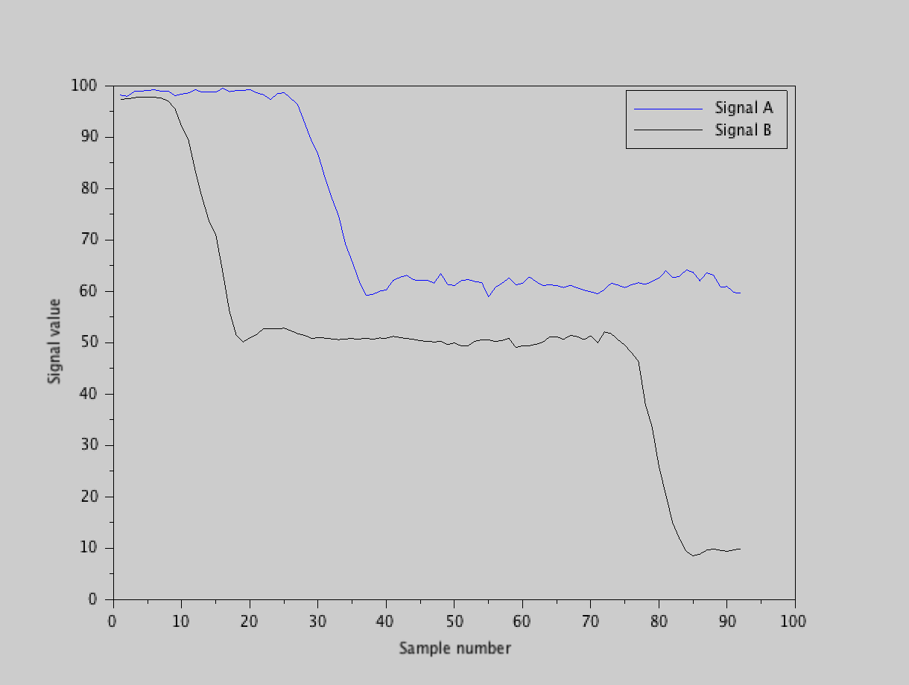
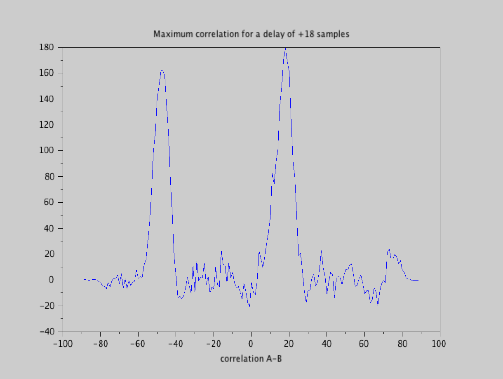
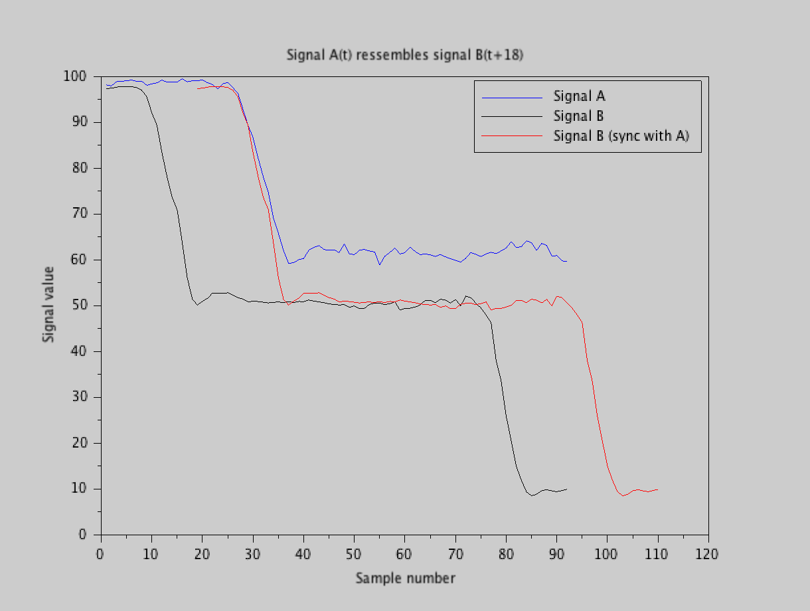

# ScilabSignalCorrelation

## Problem
How to determine the time delay between two records of the same signal ?

The typical example is :
* John moves his hand
* Kinect 1 records John --> signal A
* Kinect 2 records John --> signal B
* Kinect 1 and 2 are not time synchronised.  
     **Hence:**
* Signals A and B are time series of John's movement
* Signals A and B are not time synchronised


The situation is as follows :


In the previous figure we see that:  
* there is an offset between the two signals, and a small difference is scale
* both signals show a drop
* the "drops" in A and B should occur at the same time
* if we "slide" signal B to the right (later in time) we get the best correspondance when the "drops" align, when B is sled of `Delay` samples.


Starting form the situation in the previous figure, we can rephrase the problem :  
* we seek for the `delay` that maximises the co-occurence in time of the **changes** in A and the **changes** in B

## Solution
Because it the *same* signal that is recorded with two different sensors:

* the frequency content of A and B is the same (except for some noise, that is supposed to be white => we can forget it safely).
* the scaling of A and B is similar (we do not need to rescale one signal)

Hence, we can use *cross correlation* between A and B to determine the time lag.
Yet, because we do not want that A overlaps B, but we want that the **changes** in A and B are synchronised, we run `xcorr` on  `dA` and `dB`, where :  
*  `dA` = changes in A
*  `dB` = changes in B


The code uses the fucntion `xcorr` from scilab : [documentation for xcorr](https://help.scilab.org/docs/6.1.0/en_US/xcorr.html)

```scilab
function [delay, lags, c] = getDelayBetweenSignals(A, B)
    dA = diff(A);               // differences in A (approx time derivative)
    dB = diff(B);
    [c, lags] = xcorr(dA, dB);  // cross correlation of the derivatives
    [val, iVal] = max(c)        // find index of max correlation
    delay = lags(iVal)          // the delay is at the max of the correlation
endfunction
```

## Result
Running `getDelayBetweenSignals` with the input in the previous figure, we get :

On the previous figure, we see that the maximum correlation between `dA` and `dA` is for a lag of +18 samples.

Once we know the `delay`, we can plot `B` now synced with `A` :



## Tests
A piece of code can create signals with a **KNOWN** delay. If you turn the condition is the test to `%t`, you can change the delay `d`. 
```scilab
// create a known delay (for testing purpose)
if %F then
    d = -12; write(%io(2), sprintf("The KNOWN lag is %d samples ", d) )
    if d >= 0 then
        B = A(d+1:$); // create data using A only
        A = A(1:$-d);
    else
        B = A(1:$+d); // create data using A only
        A = A(abs(d)+1:$);
    end
    // switch A and B (for tests)
    C = B;
    B = A;
    A = C;
end
```

## Usage
* (Clone or) download the repository
* On your computer :
	* Open `main.sce` with scilab editor (SciNotes)  
	* Run the script (press F5, or click  the button with a triangle)

## Notes :
* You first need to install [Scilab](http://www.scilab.org)...
* Double click on `main.sce` might not work... depending on your OS.  
Opening files from SciNotes allways works (File menu -> open).
* *Do not modify the names and organisation of the directories*   
The DAT+PRG+RES structure is expected when initialising in `InitTRT.sce`
